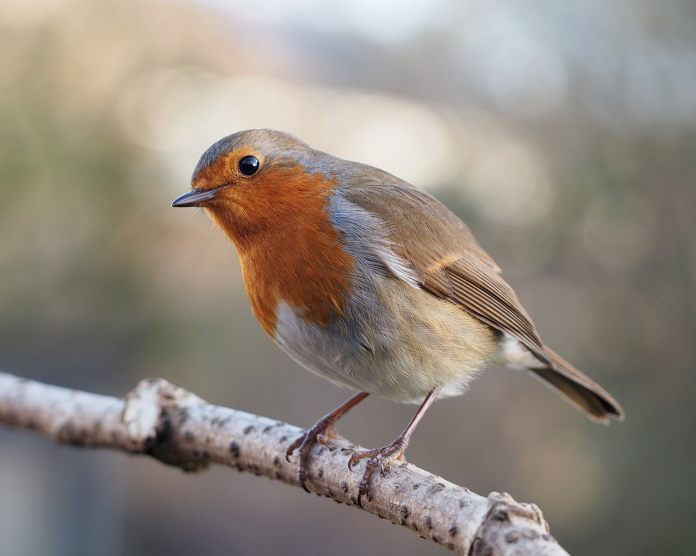

# 🪶 EncycloBird

A small, beautiful field guide to **UK garden birds** — eighteen of the most-seen species in British gardens, from the bold robin on the fencepost to the goldcrest in the conifer.

Built as the starter app for a YouTube tutorial on **adding an AI assistant to an existing app** in ten minutes, with no code.



## What's in here

- **React + Vite** — fast dev, zero config
- **18 UK garden birds** with photos, latin names, sizes, habitats, and short blurbs
- **Live search** by name, latin, or habitat
- **Editorial design** — Fraunces serif headlines, warm parchment palette, soft field-guide feel
- All bird photography sourced from **Wikimedia Commons** and vendored locally

## Run it locally

```bash
npm install
npm run dev
```

Then open [http://localhost:5173](http://localhost:5173).

## Project structure

```
EncycloBird/
├── index.html
├── public/birds/         # bird photos (local, no hotlinking)
├── src/
│   ├── App.jsx           # the page
│   ├── birds.js          # the data
│   ├── main.jsx
│   └── styles.css
└── vite.config.js
```

## What this is the starter for

This repo is the "before" state for a YouTube tutorial. The "after" is the same app with an AI bird expert chat baked in — type a question, get a warm, knowledgeable answer, see the matching bird's card highlighted.

**Try to add your own AI assistant to this project.** Fork it, fire up Claude Code or Bolt, and describe the assistant you want — a warm British birder, a David Attenborough impression, a strict ornithology professor. Same app, different brain. See how far you can take it.

If you're following along with the video: keep this repo as a clean starting point, then talk Claude Code (or Bolt) through adding the assistant.

## Credits

- Bird photography: contributors to [Wikimedia Commons](https://commons.wikimedia.org/) — please respect each image's license if reusing.
- Built by [Anay Goenka](https://github.com/anaygoenka).

## License

MIT — do whatever you like with the code. Bird photos retain their original Wikimedia Commons licenses.
